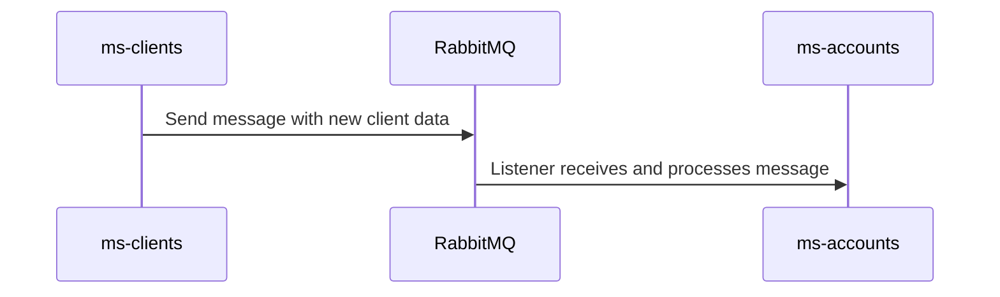

# Banking API - Spring Boot Microservices

This project consists of the implementation of two independent microservices using Java, Spring Boot, and RabbitMQ, following an event-driven, asynchronous, and decoupled architecture.

Both microservices are dockerized and designed to perform CRUD operations, validations, and communication between them through message queues.

---

## Technologies and Tools

- **Language:** Java 17
- **Frameworks and Libraries:** Spring Boot, Spring Web, Spring Data JPA, Spring AMQP
- **Messaging:** RabbitMQ
- **ORM:** Hibernate + JPA
- **Documentation:** Swagger OpenAPI
- **Database:** MySQL Server (local)
- **Containers:** Docker, Docker Compose
- **Testing:** JUnit 5, Mockito
- **Other Tools:** Maven

---

## Repository Structure

```
ms-clients-person-service      # Microservice for clients
ms-accounts-movements-service  # Microservice for accounts and movements
docker-compose.yml             # Container orchestrator
BaseDatos.sql                  # MySQL table creation script
arnaira.postman_collection     # Endpoints for local testing in Postman
README.md                      # General project explanation
README-es.md                   # General project explanation in spanish
```

---

## Project Objectives

- Allow registration, query, update, and deletion of clients.
- Register bank accounts associated with clients.
- Register banking transactions and automatically update balance.
- Validate that the balance is sufficient before performing a debit.
- Emit a RabbitMQ event when creating a client to simulate asynchronous communication.
- Listen to that event in another microservice and handle it asynchronously.

---

## Steps to Run the Project

### 1. Clone the repository

```bash
git clone https://github.com/arnaira/banking-api.git
```

### 2. Ensure MySQL Server is running

Once you have a running MySQL server instance, you can execute:

```bash
mysql -u root -p < BaseDatos.sql
```

This will create the `arnaira` database with all necessary tables.

To run it correctly in the microservices, ensure the following configuration exists in `application-docker.properties`:

```
spring.datasource.url=jdbc:mysql://host.docker.internal:3306/arnaira?useSSL=false&serverTimezone=UTC
spring.datasource.username=root
spring.datasource.password=your local mysql server password
spring.datasource.driver-class-name=com.mysql.cj.jdbc.Driver
```

### 3. Generate the .jar files

From the root of each microservice:

```bash
cd ms-clients-person-service
mvn clean package -DskipTests
cd ../ms-accounts-movements-service
mvn clean package -DskipTests
```

### 4. Build the Docker images for each microservice

From each microservice's root:

```bash
docker build -t ms-clients-person-service .
docker build -t ms-accounts-movements-service .
```

### 5. Start the containers

From the root folder (where `docker-compose.yml` is located):

```bash
docker-compose up --build
```

This will start:

- RabbitMQ
- Client microservice (port 8081)
- Account microservice (port 8082)

---

## Main Endpoints

### Clients

- `POST /api/clientes`: Create client
- `GET /api/clientes/{id}`: Get by ID
- `PUT /api/clientes/{id}`: Update
- `DELETE /api/clientes/{id}`: Delete

### Accounts, Transactions, and Report

- `POST /api/cuentas`: Create account
- `GET /api/cuentas/{id}`: Get by ID
- `PUT /api/cuentas/{id}`: Update accounts
- `POST /api/movimientos`: Register transaction
- `GET /api/movimientos/cuenta/{numeroCuenta}`: Filter by account
- `GET /api/movimientos/reportes?{numeroCuenta}&{fechaInicio}&{fechaFin}`: Filter by date and account
- `PUT /api/movimientos/{id}`: Update transactions

---

## Asynchronous Communication with RabbitMQ

When a new client is created, a message is sent to RabbitMQ.



This simulates an event-driven architecture.

---

## Swagger API Docs

Once the services are running, visit:

- **Clients:** [http://localhost:8081/swagger-ui/index.html](http://localhost:8081/swagger-ui/index.html)
- **Accounts:** [http://localhost:8082/swagger-ui/index.html](http://localhost:8082/swagger-ui/index.html)

---

## Unit Testing

The clients-person microservice includes unit test coverage using:

- **JUnit 5**
- **Mockito**

To run the unit test from the microservice root:

```bash
mvn test
```

The unit test was created for the client domain entity.

Note: An integration test was started but not completed due to time constraints. However, it is included in the project.

---

## Future Improvements

Planned future improvements:

- Implement integration tests for both microservices.
- Incorporate security with JWT or OAuth2 for endpoint protection.
- Automate account number creation when creating a client, using the message received in the RabbitMQ listener.
- Use a Docker container for MySQL, eliminating the local server dependency.
- Develop a frontend that consumes the endpoints and improves system interaction.
- Expand documentation with architecture diagrams, data flow, and design analysis.
- Improve error handling with stronger validations and detailed responses.
- Extend the system to include functionalities like account closure, transaction reversal, and advanced financial reports.

---

## Contact

-Developed by Ana Rivera

-Email: [ana.rivera2023@gmail.com](mailto:ana.rivera2023@gmail.com)

---

## Other Languages
[Ver esta documentacion en Espanol](README-es.md)
